#  Building MALDI-DB: A Community-Driven Mass Spectrometry Platform

Technical Retrospective

Author: David Shumway

Last updated July 19, 2026

## Introduction

In 2018, our team set out to build MALDI-DB, a web platform for bacterial identification using MALDI-TOF mass spectrometry. The goal was ambitious: create a community-driven repository where researchers could upload, share, and analyze bacterial protein spectra, with integrated machine learning workflows for identification. Think of it as an online version of IDBac, but with a centralized repository and collaborative features that didn't exist in the scientific community.

The platform was built during a development burst from December 2020 to August 2021, roughly eight months of active coding at the tail end of a three-year project. During that time, we built: a Django backend with PostgreSQL, R integration for scientific computing, Docker deployment, and a thoughtful data model capturing the complexity of mass spectrometry experiments. This post walks through the technical architecture, the decisions we made, and the lessons learned.

## The Architecture

Overview

The platform consists of several integrated components:

```
┌─────────────────┐     ┌──────────────┐     ┌─────────────────┐
│   Django App    │───▶│  PostgreSQL  │     │   R Services    │
│  (Web/Models)   │◀───│   Database   │     │  (plumber/Rpy2) │
└─────────────────┘     └──────────────┘     └─────────────────┘
         │                       │                      │
         ▼                       ▼                      ▼
┌─────────────────┐     ┌──────────────┐     ┌─────────────────┐
│   Thread()      │     │   File Store │     │   MALDIquant    │
│  (Long-running) │     │(User uploads)│     │  IDBacApp       │
└─────────────────┘     └──────────────┘     └─────────────────┘
```

## Why Django?

We chose Django for several reasons that proved essential for a scientific platform:

1. Rapid development - Built-in admin interface let us prototype data models quickly and gave domain scientists immediate access to the data structure.
2. Scalability - Django's ORM handles complex queries efficiently, critical when searching across thousands of spectra with multiple filter criteria.
3. Ecosystem - Libraries like django-tables2, django-filter, and django-autocomplete-light saved months of development time on common patterns.
4. Security - Built-in protections for authentication, CSRF, XSS, and SQL injection are essential for a platform that might eventually hold sensitive research data.
5. Admin interface - The automatic admin interface was invaluable for debugging and giving the team direct data access during development.

The models.py tells the story: 15+ models capturing spectra, metadata, libraries, user tasks, and experimental context. Each model reflects real scientific concepts from the IDBac R package that the domain scientists had already developed.

## The Data Model Challenge

Mass spectrometry data is complex. Each spectrum comes with:

* Peak lists (mass/intensity/SNR values)
* Instrument settings (laser attenuation, TOF mode, mass range)
* Experimental metadata (cultivation conditions, matrix type)
* Sample information (strain ID, taxonomy)
* Processing history (preprocessing steps, peak picking parameters)

We made several key design decisions that shaped the platform:

1\. Store peak data as text fields

```python
peak_mass = models.TextField(blank=True,
    help_text='A list of comma separated values, e.g., "1,2,3"')
peak_intensity = models.TextField(blank=True,
    help_text='A list of comma separated values, e.g., "1,2,3"')
peak_snr = models.TextField(blank=True,
    help_text='A list of comma separated values, e.g., "1,2,3"')
```

This might look odd to someone coming from traditional relational database design, but it's pragmatic. Peak lists are variable-length (from dozens to thousands of peaks) and are almost always accessed as whole units. JSON/text storage avoids complex normalization and performs well for our use case. The alternative—a separate Peak table with foreign keys—would create millions of rows and slow down queries dramatically.

2\. Separate instrument metadata into XML table

```python
class XML(models.Model):
    xml_hash = models.CharField(max_length=255, blank=True)
    xml = models.TextField(blank=True)  # Full instrument XML
    manufacturer, model, ionization, analyzer, detector
```

Bruker MALDI-TOF instruments generate XML files with hundreds of parameters. Rather than flattening all of these into the Spectra model (which would have required dozens of nullable fields and constant schema changes when new instrument versions appeared), we stored the raw XML and extracted key searchable fields. This preserved the complete instrument context while keeping the schema stable.

3\. Abstract base classes for common patterns

```python
class AbstractSpectra(models.Model):
    privacy_level, created_by, lab_name, library
    peak_mass, peak_intensity, peak_snr
    
    class Meta:
        abstract = True

class Spectra(AbstractSpectra):
    # Full spectra with all instrument fields
    pass

class CollapsedSpectra(AbstractSpectra):
    # Averaged spectra from multiple replicates
    collapsed_spectra = models.ManyToManyField('Spectra')
    peak_percent_presence = models.DecimalField(max_digits=4, decimal_places=1)
    
class SearchSpectra(AbstractSpectra):
    # Temporary spectra for user queries
    created_by = models.ForeignKey(User)
```

This inheritance pattern allowed us to reuse the core peak data structure across different contexts while adding specialized fields where needed. The CollapsedSpectra model, for example, tracks which original spectra were averaged and the parameters used (percent presence, SNR threshold) for full reproducibility.

4\. Comprehensive metadata tracking

```python
class Metadata(models.Model):
    strain_id = models.CharField(max_length=255, blank=True)
    genbank_accession, ncbi_taxid
    cKingdom, cPhylum, cClass, cOrder, cGenus, cSpecies
    maldi_matrix, dsm_cultivation_media
    cultivation_temp_celsius, cultivation_time_days
    user_firstname_lastname, user_orcid
    pi_firstname_lastname, pi_orcid
    dna_16s
```

The Metadata model captures the biological context that makes spectra meaningful. This level of detail, down to cultivation media and temperature, is essential for reproducibility. A spectrum without its experimental context is nearly useless for future researchers trying to replicate or build upon findings.

## R Integration: Two Approaches

The IDBac R package already contained mature algorithms for peak processing, binning, and cosine similarity calculations. Our challenge was integrating this existing scientific code with a modern web application. We tried two approaches:

Approach 1: rpy2 (in-process)

```python
from rpy2.robjects import r as R
import rpy2.robjects as robjects

R('''
  binPeaks <- function(allPeaks, allSpectra) {
    binnedPeaks <- MALDIquant::binPeaks(allPeaks, tolerance = 0.002)
    featureMatrix <- MALDIquant::intensityMatrix(binnedPeaks, allSpectra)
    d <- stats::as.dist(coop::tcosine(featureMatrix))
    as.matrix(d)
  }
''')
```

Pros:

* Simple Python-R communication in the same process
* No network latency
* Direct memory sharing

Cons:

* R runs in the Django process, risking stability
* Memory issues with large datasets (R's garbage collection vs Python's)
* GIL limitations
* Deployment complexity (R must be installed in the same environment)

Approach 2: plumber R API (out-of-process)

```r
# plumber.R
library(plumber)
library(MALDIquant)
library(coop)
library(RPostgreSQL)

#* @post /binPeaks
function(req, id, ids) {
  # Query PostgreSQL directly from R
  con <- dbConnect(...)
  query <- paste0("SELECT peak_mass, peak_intensity, peak_snr 
                   FROM chat_spectra WHERE id IN (", 
                   paste(ids, collapse=','), ")")
  spectra_data <- dbGetQuery(con, query)
  
  # Create MALDIquant objects
  allPeaks <- list()
  for(i in 1:nrow(spectra_data)) {
    row <- spectra_data[i,]
    allPeaks[[i]] <- createMassPeaks(
      mass = as.numeric(strsplit(row$peak_mass, ",")[[1]]),
      intensity = as.numeric(strsplit(row$peak_intensity, ",")[[1]]),
      snr = as.numeric(strsplit(row$peak_snr, ",")[[1]])
    )
  }
  
  # Compute similarity
  binnedPeaks <- binPeaks(allPeaks, tolerance = 0.002)
  featureMatrix <- intensityMatrix(binnedPeaks, allSpectra)
  similarity <- as.matrix(as.dist(tcosine(featureMatrix)))
  
  return(similarity[1,])  # First row = query vs all others
}
```

Pros:

* Isolated process, i.e. R crashes don't take down Django
* Can scale independently
* Better memory management
* Clean separation of concerns
* R can query PostgreSQL directly

Cons:

* Network latency
* Serialization overhead
* Additional deployment complexity

We settled on the plumber approach for production. The R service runs on port 7001 in its own Docker container, communicates via JSON, and handles the heavy scientific computing. This architecture proved more robust, especially when processing large datasets where memory usage was unpredictable.

## Handling Long-Running Tasks

Scientific workflows aren't instant. A user might:

* Upload a SQLite database with thousands of spectra (minutes)
* Collapse replicates across a whole library (minutes to hours)
* Search for similar spectra across the entire database (seconds to minutes)
* Preprocess raw mzML files (minutes each)

We couldn't make users wait synchronously. The solution was an async task system with progress tracking.

The Task Models

```python
class UserTask(models.Model):
    owner = models.ForeignKey(User, on_delete=models.CASCADE)
    task_choices = [
        ('idbac_sql','Insert IDBac SQLite data to database'),
        ('spectra','Add spectra files to database'),
        ('preprocess','Preprocess spectra'),
        ('collapse','Collapse replicates'),
        ('cos_search','Cosine score search'),
    ]
    task_description = models.CharField(max_length=255, choices=task_choices)
    statuses = models.ManyToManyField('UserTaskStatus')
    last_modified = models.DateTimeField(auto_now_add=True)

class UserTaskStatus(models.Model):
    status_choices = [
        ('start', 'Started'),
        ('run', 'Running'),
        ('complete', 'Completed'),
        ('error', 'Completed - Error'),
        ('info', 'Info')
    ]
    status = models.CharField(max_length=255, choices=status_choices)
    status_date = models.DateTimeField(auto_now_add=True)
    extra = models.TextField(blank=True, null=True)  # Error messages, progress
    user_task = models.ForeignKey(UserTask, on_delete=models.CASCADE, blank=True, null=True)
```

This design gives users visibility into long-running operations. Each task can have multiple status updates, with optional extra text for error details or progress percentages.

The Threading Decorator

```python
def start_new_thread(function):
    '''Starts a new thread for long-running tasks'''
    def decorator(*args, **kwargs):
        t = Thread(target=function, args=args, kwargs=kwargs)
        t.daemon = True
        t.start()
        return t
    return decorator

@start_new_thread
def idbac_sqlite_insert(request, tmpForm, uploadFile, user_task):
    try:
        _idbac_sqlite_insert(request, tmpForm, uploadFile, user_task)
    except Exception as e:
        user_task.statuses.add(
            UserTaskStatus.objects.create(
                status='error',
                extra='Unexpected exception: {}: {}'.format(type(e).__name__, e),
                user_task=user_task
        ))
    finally:
        user_task.statuses.add(
            UserTaskStatus.objects.create(
                status='complete', user_task=user_task
        ))
```

This simple decorator lets us mark any function as async. The daemon=True ensures threads don't block server shutdown. For production, we would migrate to Celery for better reliability, but this served well during development.


## Websocket Usage in maldidb

### Architecture Overview

The application uses **two complementary websocket patterns** to enable real-time communication for long-running operations:

1. **Django Channels Consumer** - Server-to-client messaging hub for UI updates
2. **Direct WebSocket Connections** - Worker-to-hub communication for background tasks

---

### Django Channels Consumer

#### Implementation
Located in `mdb/chat/consumer.py`, the `DashConsumer` class extends `AsyncJsonWebsocketConsumer` from Django Channels.

#### Connection Management
- Clients connect to the `'dashboard'` websocket group
- Each connection receives a unique `client_id` (UUID) for message routing
- The consumer maintains a module-level `clients` dictionary mapping `client_id` to consumer instances

#### Message Types and Handlers

##### Spectra Analysis Operations
- **`library comparison`** - Initiates cosine similarity comparison between two libraries
- **`library comparison result`** - Routes comparison results back to requesting client
- **`search existing`** - Searches unknown spectra against an existing reference library
- **`single score`** - Retrieves full scoring data (dendrogram + similarity scores)
- **`single score result`** - Sends detailed comparison results with binned peaks and taxonomy

##### File Upload and Processing
- **`completed preprocessing`** - Notifies client when R preprocessing of spectra files completes
- **`collapse library`** - Triggers spectrum collapsing/averaging operation
- **`completed collapsing`** - Returns list of collapsed spectra IDs with metadata
- **`completed cosine`** - Sends cosine similarity results after library-wide comparisons

##### NCBI Taxonomy Alignment
- **`align`** - Initiates automatic NCBI taxonomy database search for strain identification
- **`align status`** - Sends progress updates during alignment search (e.g., "Searching 5 of 1000")
- **`completed align`** - Returns exact and partial matches from NCBI
- **`manual_align`** - Allows manual specification of genus/species for alignment
- **`completed manual align`** - Returns results of manual alignment attempt
- **`save align`** / **`save manual align`** - Confirms taxonomic metadata has been persisted to database

---

### Background Task Websocket Communication

#### Pattern and Implementation

Long-running computational tasks are executed in background threads (decorated with `@start_new_thread`) located across multiple modules:
- `mdb/spectra/wsviews.py`
- `mdb/spectra_search/views.py`
- `mdb/ncbitaxonomy/views.py`

These threads establish direct websocket connections to communicate completion status:

```python
ws = websocket.WebSocket()
ws.connect('ws://localhost:8000/ws/pollData')
ws.send(json.dumps({
  'type': 'message_type',
  'data': {'client': client_id, ...}
}))
ws.close()
```

#### Background Tasks with Websocket Notifications

| Task | Location | Notification | Payload |
|------|----------|--------------|---------|
| **File Preprocessing** | `process_file()` | `completed preprocessing` | upload count, client ID |
| **Library Collapsing** | `collapse_lib()` | `completed collapsing` | list of collapsed spectra with IDs and strain info |
| **Cosine Scoring** | `cosine_scores()` | `completed cosine` | top 5 similarity scores, taxonomy, binned peaks |
| **Single Score Details** | `single_score()` | `single score result` | dendrogram, full binned peaks, complete score ranking |
| **Library Comparison** | `cosine_score_libraries()` | `library comparison result` | network graph edges with similarity scores |
| **NCBI Alignment** | `align()` | `align status` (periodic) + `completed align` | progress updates, then exact/partial NCBI matches |
| **Alignment Persistence** | `save_align()` | `completed save align` | confirmation only |
| **Manual Alignment** | `manual_align()` | `completed manual align` | results with manual genus/species assignments |
| **Manual Alignment Save** | `save_manual_align()` | `completed save manual align` | confirmation only |

---

### Data Flow Architecture

```
┌─────────────────────────────────────────────────────────────┐
│ Client (Web Browser)                                        │
│                                                             │
│  Initiates request (e.g., "search existing spectra")       │
└─────────────────────┬───────────────────────────────────────┘
                      │
                      ▼
┌─────────────────────────────────────────────────────────────┐
│ Django Channels - DashConsumer                              │
│                                                             │
│  • Receives message via websocket                          │
│  • Routes to appropriate background task function           │
│  • Spawns @start_new_thread function with client_id        │
│  • Maintains client_id → consumer mapping                   │
└─────────────────────┬───────────────────────────────────────┘
                      │
                      ▼
┌─────────────────────────────────────────────────────────────┐
│ Background Thread (Long-Running Computation)                │
│                                                             │
│  • Queries database                                        │
│  • Calls R microservice (plumber:8000) if needed            │
│  • Processes results                                       │
│  • Connects to /ws/pollData endpoint                        │
│  • Sends completion message with client_id                 │
└─────────────────────┬───────────────────────────────────────┘
                      │
                      ▼
┌─────────────────────────────────────────────────────────────┐
│ DashConsumer Message Router                                 │
│                                                             │
│  • Receives completion message from background task         │
│  • Looks up client by client_id in clients dict            │
│  • Routes result back to specific client                    │
└─────────────────────┬───────────────────────────────────────┘
                      │
                      ▼
┌─────────────────────────────────────────────────────────────┐
│ Client Receives Update (No Page Reload)                     │
│                                                             │
│  • WebSocket receives message                              │
│  • JavaScript updates UI with results                       │
│  • User sees dendrogram, scores, or status in real-time     │
└─────────────────────────────────────────────────────────────┘
```

---

### Key Design Patterns

#### Client Identification
Each websocket connection generates a unique UUID (`client_id`) on initial connection. This ID is:
- Sent back to the client in the `connect` handler
- Included in every message the client sends
- Used to route responses back to the originating client
- Essential for handling concurrent requests from multiple users

#### Thread Safety
Background tasks use the `@start_new_thread` decorator to avoid blocking the main Django/Channels event loop. Each thread:
- Creates its own websocket connection to `/ws/pollData`
- Sends results via JSON
- Closes the connection after sending

#### Asynchronous UI Updates
This architecture enables:
- Users to initiate multiple analyses simultaneously
- Real-time progress feedback during long computations
- No page refreshes required for completion notifications
- Responsive UI while waiting for results (e.g., dendrogram generation, cosine similarity calculations)


## User Management and Community Features

A community-driven database needs social features. We built:

Lab Groups with Owners and Members

```python
class LabGroup(models.Model):
    lab_name = models.CharField(max_length=200)
    lab_description = models.TextField(blank=True)
    owners = models.ManyToManyField(settings.AUTH_USER_MODEL)
    members = models.ManyToManyField(settings.AUTH_USER_MODEL,
        blank=True, related_name="lab_members")
```

This models real research groups. Owners can manage the lab, members can contribute data. The platform automatically adds owners as members on creation (though the commented signal handler shows we had to work through some Django quirks).

## Privacy Controls at Multiple Levels

```python
PUBLIC = 'PB'
PRIVATE = 'PR'
privacyChoices = [
    (PUBLIC, 'Public'),
    (PRIVATE, 'Private'),
]

# Applied to libraries, spectra, and user data
privacy_level = models.CharField(
    max_length=2,
    choices=privacyChoices,
    default=PUBLIC,
)
```

Researchers need control over their data. Some projects are pre-publication and must remain private. Others can be shared immediately. By making privacy granular (at the library and individual spectra level), we give users flexibility while encouraging sharing.

## Quality Ratings Inspired by GNPS

```python
GOLD = 'GO'
SILVER = 'SI'
BRONZE = 'BR'
qualChoices = [
    (GOLD, 'Gold'),
    (SILVER, 'Silver'),
    (BRONZE, 'Bronze'),
]
quality_rating = models.CharField(
    max_length=2,
    choices=qualChoices,
    default=BRONZE,
)
```

Not all data is equal. Gold standards are manually curated, silver comes from published studies, bronze is community-submitted. This tiered system, borrowed from GNPS, lets users trust results appropriately.

## ORCID Integration for Academic Credit

```python
user_firstname_lastname = models.CharField(max_length=255, blank=True)
user_orcid = models.CharField(max_length=255, blank=True)
pi_firstname_lastname = models.CharField(max_length=255, blank=True)
pi_orcid = models.CharField(max_length=255, blank=True)
```

In academia, credit matters. Storing ORCIDs ensures contributors can be properly cited and tracked. This also helps with attribution when data gets reused in publications.

## User Profiles with Social Features

The profile.html template shows a clean user profile interface:

```html
<div class="card">
  
    
  
    <div class="container mt-1 text-center"><i class="fas fa-9x fa-user"></i></div>
  
  <div class="card-body">
    <div class="card-title">
      {{ user.first_name }} {{ user.last_name }}
    </div>
    <div class="card-text">
      {{ user.profile.bio }}
    </div>
  </div>
  <ul class="list-group list-group-flush">
    <li class="list-group-item"><strong><i class="fa fa-fw fa-user-alt"></i></strong> {{ user.username }}</li>
    <li class="list-group-item"><strong><i class="fa fa-fw fa-envelope"></i></strong> {{ user.email }}</li>
    <li class="list-group-item"><strong><i class="fa fa-fw fa-phone"></i></strong> {{ user.profile.phone }}</li>
    <li class="list-group-item"><strong><i class="fa fa-fw fa-globe"></i></strong> {{ user.profile.website }}</li>
    <li class="list-group-item"><strong><i class="fa fa-fw fa-map-marker-alt"></i></strong> {{ user.profile.address }}</li>
  </ul>
</div>
```

The User model extends Django's AbstractUser to add lab memberships and follower relationships:

```python
class User(AbstractUser):
    followers = models.ManyToManyField("self", blank=True)
    lab_name = models.ManyToManyField(LabGroup, blank=True)
    
    def is_following(self, user):
        return user in self.followers.all()
```

This enables researchers to follow other labs' work, building a collaborative network around the data.

## Search and Discovery

The search interface needed to handle complex queries: taxonomic filters, instrument parameters, and spectral similarity.

Cascading Autocomplete Filters

```python
class MetadataAutocomplete(autocomplete.Select2QuerySetView):
    def get_queryset(self):
        qs = Metadata.objects.all().order_by(self.view).distinct(self.view)
        if self.forwarded:
            for attr, val in self.forwarded.items():
                kwargs = {'{0}__{1}'.format(attr, 'in'): val}
                qs = qs.filter(**kwargs)
        return qs
```

This powers the cascading filters in the UI: select Kingdom → filters Phylum options to only those in that Kingdom → filters Class options, etc. It's a natural way for microbiologists to navigate taxonomy.

Spectral Similarity Search

The core scientific feature: take an unknown spectrum and find similar ones in the database.

```python
# In FilteredSpectraSearchListView.get_queryset()
if form.is_valid():
    # Create a SearchSpectra object for the query
    search_spectra, created = SearchSpectra.objects.get_or_create(
        peak_mass=cleaned_data['peak_mass'],
        peak_intensity=cleaned_data['peak_intensity'],
        peak_snr=cleaned_data['peak_snr'],
        created_by=request.user
    )
    
    # Build database query with filters
    queryset = Spectra.objects.all()
    if scut == 'small':
        queryset = queryset.filter(max_mass__lt=6000)
    elif scut == 'protein':
        queryset = queryset.filter(max_mass__gt=6000)
    
    # Apply taxonomic filters
    if cleaned_data.get('libraryXX'):
        queryset = queryset.filter(library__in=cleaned_data['libraryXX'])
    if cleaned_data.get('lab_nameXX'):
        queryset = queryset.filter(lab_name__in=cleaned_data['lab_nameXX'])
    
    # Get IDs for R processing
    spectra_ids = list(queryset.values_list('id', flat=True))
    
    # Call R API for similarity computation
    response = requests.post(
        'http://localhost:7001/binPeaks',
        json={'id': search_spectra.id, 'ids': spectra_ids}
    )
    scores = response.json()
    
    # Sort by similarity score
    sorted_spectra = sorted(
        zip(spectra_ids, scores),
        key=lambda x: x[1],
        reverse=True
    )
    
    # Preserve order in queryset
    preserved = Case(*[When(pk=pk, then=pos) for pos, (pk, _) in enumerate(sorted_spectra)])
    return Spectra.objects.filter(id__in=[pk for pk, _ in sorted_spectra]).order_by(preserved)
```

The tables.py shows how we inject scores into the results table:

```python
class CosineSearchTable(tables.Table):
    score = tables.Column(accessor='id', verbose_name='Score')
    
    def __init__(self, *args, **kwargs):
        if kwargs.get('data'):
            d = kwargs.pop('data', None)
            self.testing_data = d.get('scores', None)
            kwargs.setdefault('data', d.get('queryset', None))
        super().__init__(*args, **kwargs)
    
    def render_score(self, record):
        return self.testing_data.get(record.id, None)
```

This approach lets users see exactly how similar each match is to their query.

## User Interface Design

The UI needed to be approachable for microbiologists who might not be bioinformatics experts. The basic_search.html template shows our design philosophy:

Progressive Disclosure

```html
<div id="accordion">
  <!-- Upload panel - initially expanded -->
  <div class="card">
    <div class="card-header" id="headingOne">
      <h5 class="mb-0">
        <button class="btn btn-link" data-toggle="collapse" data-target="#collapseOne" 
                aria-expanded="true" aria-controls="collapseOne">
          Upload new file of unknown isolate
        </button>
      </h5>
    </div>
    <div id="collapseOne" class="collapse show" ...>
      <!-- Upload form -->
    </div>
  </div>
  
  <!-- Filters panel - initially collapsed -->
  <div class="card">
    <div class="card-header" id="headingTwo">
      <h5 class="mb-0">
        <button class="btn btn-link collapsed" data-toggle="collapse" data-target="#collapseTwo">
          Search filters
        </button>
      </h5>
    </div>
    <div id="collapseTwo" class="collapse" ...>
      <!-- Taxonomic filters -->
    </div>
  </div>
</div>
```

This accordion design keeps the interface simple for basic use while making advanced options available when needed.

Custom File Input Styling

```javascript
$(".custom-file-input").on("change", function() {
  var filename = $(this).val().split("\\").pop();
  $(this).siblings(".custom-file-label").addClass("selected").html(filename);
});
```

Bootstrap's custom file input doesn't show the selected filename by default. This simple fix improves usability dramatically.

## Deployment with Docker

The entrypoint.sh script and docker-compose configuration made deployment reproducible:

```bash
#!/bin/sh
# entrypoint.sh

if [ "$DATABASE" = "postgres" ]; then
    echo "Waiting for postgres..."
    while ! nc -z $DATABASE_HOST $DATABASE_PORT; do
      sleep 0.1
    done
    echo "PostgreSQL started"
fi

# Make migrations and migrate the database
python manage.py makemigrations --noinput
python manage.py migrate --noinput
python manage.py collectstatic --noinput

exec "$@"
```

The Docker Compose setup orchestrated all services:

```yaml
version: '3'
services:
  volume_configurer:
    image: busybox
    volumes:
      - shared:/shared:z
      - static:/static:z
    command: ["/bin/sh", "-c", "
      mkdir -p /static;
      chmod -R 777 /static;
      mkdir -p /shared/sync;
      chmod -R 777 /shared/sync;
      echo STARTED > /shared/sync/volumesetter && chmod a+r /shared/sync/volumesetter"]
  db:
    container_name: postgresdb
    image: postgres:latest
    restart: always
    env_file:
     - project.env
    ports:
      - "127.0.0.1:5432:5432"
    volumes:
      - postgres-data1:/var/lib/postgresql/data1:z
  plumber:
    build:
      context: ./
      dockerfile: ./rplumber/Dockerfile
    container_name: rplumber
    command: /app/plumber.R
    restart: always
    env_file:
      - project.env
    ports:
      - "127.0.0.1:7002:8000"
    volumes:
      - ./rplumber:/app:z
      - shared:/app/uploads:z
  web:
    build:
      context: ./
      dockerfile: ./mdb/Dockerfile
    container_name: django
    command: >
      daphne mdb.asgi:application -b 0.0.0.0 -p 8000
    env_file:
      - project.env
    ports:
      - "127.0.0.1:8000:8000" # 8000
    depends_on:
      - db
      - plumber
    volumes:
      - ./mdb:/home/app/web/:z
      - static:/home/app/web/static/:z
      - shared:/uploads/:z
    environment:
      PYTHONUNBUFFERED: 1  # better printing
  nginx:
    container_name: nginx
    image: nginx
    restart: always
    ports:
      - 80:80
    volumes:
      - ./nginx:/etc/nginx/conf.d:z
      - static:/home/app/web/static/:z
    depends_on:
      - web
      - db
      - plumber

volumes:
  postgres-data1:
  static: 
  shared:
```

This approach gave us:

* Reproducible deployments - same stack everywhere
* Isolation - each service in its own container
* Scalability - could scale R API independently if needed
* Development/production parity - same environment locally and on servers

The requirements.txt shows the core dependencies:

```
Django==3.1
Pillow
pytz
sqlparse
django-tables2
dj_database_url
django-filter
django-bootstrap4
sklearn
django-jquery
psycopg2
psycopg2-binary
django-extensions
django-autocomplete-light
pandas
requests
pydotplus
djangorestframework
channels
websocket-client
uvloop
daphne
websockets
django-markdown
django-markdownx
```

## Data Import Pipeline

A major feature was importing IDBac SQLite databases. We needed to bring IDBac SQLite data into PostgreSQL while preserving all metadata.

```python
@start_new_thread
def idbac_sqlite_insert(request, tmpForm, uploadFile, user_task):
    try:
        _idbac_sqlite_insert(request, tmpForm, uploadFile, user_task)
    except Exception as e:
        user_task.statuses.add(
            UserTaskStatus.objects.create(
                status='error',
                extra='Unexpected exception: {}: {}'.format(type(e).__name__, e),
                user_task=user_task
        ))
    finally:
        user_task.statuses.add(
            UserTaskStatus.objects.create(
                status='complete', user_task=user_task
        ))
```

The import handles various edge cases:

```python
# Handle malformed data
if 'na' in row[4].lower():
    user_task.statuses.add(
        UserTaskStatus.objects.create(
            status='error',
            extra='Peak mass, intensity, or SNR contains "NA" value',
            user_task=user_task
    ))
    continue
```

And different database versions:

```python
# Handle schema differences between IDBac versions
t = 'IndividualSpectra' if idbac_version == '1.0.0' else 'spectra'
rows = cursor.execute('SELECT * FROM '+t).fetchall()
```

The import supports:

* Single file uploads
* Batch imports of all R01 data files (13+ SQLite databases)
* Progress tracking through UserTaskStatus
* Error logging for debugging
* Preservation of all relationships (XML → Spectra, Metadata → Spectra)

## Experimental Graph Visualization

Beyond the core search and library management features, we experimented with graph-based approaches for visualizing relationships between spectra.
The idea: treat each spectrum as a node, connect nodes based on similarity scores, and observe how spectra cluster across libraries.

The final chart below compares two libraries (IDs 266 and 267) from Iceland. Each node represents a spectrum, colored by library (green for library 266, orange for 267).
Node size reflects degree (number of connections). Edge styles encode similarity strength:

* Red, heavy — cosine similarity ≥ 0.99 (very close matches)
* Solid — 0.95 ≤ similarity < 0.99 (strong matches)
* Blue, dashed — similarity < 0.95 (weaker connections)

Network visualization comparing two Iceland libraries. Green nodes (library 266) and orange nodes (library 267) show clear separation with only a few cross-library connections.
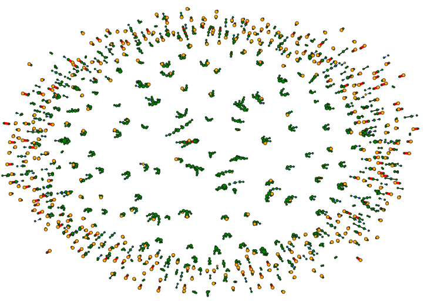

_Observations_

This visualization, generated from a live API endpoint (/spectra/lib-compare/266,267/), illustrates several useful properties:

* Library separation: Green and orange nodes form largely distinct clusters, suggesting the two libraries contain different bacterial populations.
* Within-library similarity: Dense connections (red/solid edges) within each cluster indicate strong spectral consistency among spectra from the same library.
* Outlier detection: A few nodes show weaker connections (blue dashed edges) to their primary cluster, potentially indicating technical replicates with lower similarity or distinct strains.
* Cross-library relationships: The few connections between green and orange clusters (visible at the cluster boundaries) suggest some spectral similarity across libraries—possibly shared genera or similar protein profiles.

This graph approach, while experimental, points toward intuitive visual tools for:

* Quality control: spotting spectra that don't fit expected clusters
* Exploratory analysis: discovering relationships between libraries at a glance
* Community curation: helping users understand library composition before diving into formal identification workflows

    


    

## Testing Strategy

We built comprehensive tests for critical paths:

```python
class FollowerTestCase(TestCase):
    def setUp(self):
        self.user = User.objects.create(username='john')
        self.user.set_password('secret')
        self.user.save()
        self.client.login(username='john', password='secret')
        self.a_user = User.objects.create(username='a_')
        self.b_user = User.objects.create(username='b_')
        self.user.followers.add(self.a_user)

    def test_followers_view(self):
        response = self.client.get(reverse('accounts:followers'))
        self.assertTemplateUsed(response, 'accounts/followers.html')
        self.assertEqual(len(response.context['users_followed']), 1)
        self.assertEqual(len(response.context['unfollowed_users']), 1)
    
    def test_add_followers_view(self):
        response = self.client.get(reverse('accounts:follow', args=('b_', )))
        self.assertRedirects(response, reverse('accounts:followers'))
        self.assertEqual(self.user.followers.count(), 2)
```

Tests covered:

* User authentication and registration
* Profile editing
* Follower relationships
* Model constraints and validation

The tests.py in the accounts app shows thorough testing of the social features, ensuring the platform's community aspects worked reliably.

## Hosting on Mass Open Cloud

The platform was deployed on the Mass Open Cloud (MOC) Kaizen OpenStack cluster, a research cloud operated by Boston University, Northeastern University, and Harvard.
This gave us the flexibility to run the full stack: Django web app, PostgreSQL, and the R plumber API, all containerized and orchestrated with Docker Compose on OpenStack instances.

Using MOC was a deliberate choice. We wanted:

* Reproducibility: Containers on OpenStack meant the stack could be recreated anywhere
* No vendor lock-in: Avoiding AWS, Google Cloud, or Azure kept the project aligned with academic values
* Community: MOC's mission of supporting research aligned with MALDI-DB's mission of supporting open science

In July 2022, we received notice that the MOC Kaizen cluster would be decommissioned.
The option to migrate to the New England Research Cloud (NERC) existed, but with the project no longer active, we let the instances shut down.

## Lessons Learned

What Worked Well

1. Separating R into a service: The plumber API proved more robust than in-process rpy2 for large computations. It also made it easier to update R packages independently.
2. Task tracking with UserTask/UserTaskStatus: This gave users visibility into long-running operations and helped debug issues in production. The extra text field was invaluable for capturing error details.
3. Docker from day one: Made onboarding new developers trivial and ensured consistent environments. The entrypoint.sh script handling migrations automatically saved countless manual steps.
4. Django's ecosystem: django-tables2 saved months of table rendering code. django-filter handled complex query building. django-autocomplete-light made the cascading taxonomy filters possible with minimal JavaScript.
5. Abstract base classes: The AbstractSpectra pattern reduced code duplication and ensured consistency across Spectra, CollapsedSpectra, and SearchSpectra.
6. Progressive disclosure in UI: The accordion design kept the interface manageable while providing access to advanced features when needed.
7. WebSockets for long-running operations: Django Channels enabled real-time feedback on background tasks (preprocessing, cosine scoring, taxonomy alignment) without polling or page refreshes. The client_id routing pattern allowed concurrent user requests to be handled independently, and the separation between the Channels consumer and background worker threads kept the event loop responsive while R services and database queries ran in parallel.

What We'd Do Differently

1. Async from the start: We started with synchronous views, then added threading, then considered Celery. Begin with Celery for long-running tasks to avoid refactoring later.
2. API-first design: Building a REST API alongside the web views would have made integration with external tools easier. The plumber API was a good start, but a full Django REST Framework layer would have been cleaner.
3. More comprehensive error handling: Real-world data is unpredictable. More validation and error recovery would help. The 'na' in row[4].lower() check caught many issues, but there were more.
4. Better monitoring: With separate services (Django, PostgreSQL, R API), we needed better logging and metrics.
5. User testing earlier: The interface worked, but user feedback would have refined workflows. The cascading taxonomy filters, for example, could have been simplified based on real usage.
6. Versioned API for R services: The plumber API endpoints (/binPeaks, /cosine) didn't have versioning. As algorithms improved, we'd need to support both old and new versions.

## The Codebase Today

The complete platform includes:

* 15+ Django models capturing the scientific domain
* R integration via plumber API with MALDIquant and IDBacApp
* Async task queue with progress tracking
* AJAX file uploads with progress indicators
* Advanced search with cascading taxonomic filters
* Spectral similarity search using cosine similarity
* User management with lab groups, ORCIDs, and social features
* Comprehensive testing for critical paths
* Docker deployment with docker-compose
* Responsive UI using Bootstrap 4

## The Platform in Action

The following screenshots show MALDI-DB as it existed in mid-2021—functional, usable, and very much still in progress. The UI is Bootstrap 4, the workflows reflect real scientific needs, and the data is real.

*Home & Authentication*

New users could register directly, with ORCID fields built into the profile system for academic credit.

Home screen with two primary workflows: search or library management
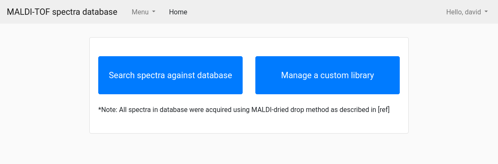

Registration form—simple, with standard fields
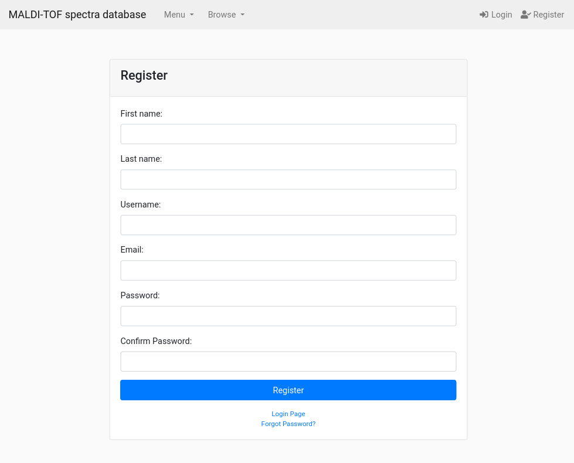


*Library Management*

Users could create libraries, import data from IDBac SQLite files, and manage metadata.

Library list view with spectra counts and privacy settings
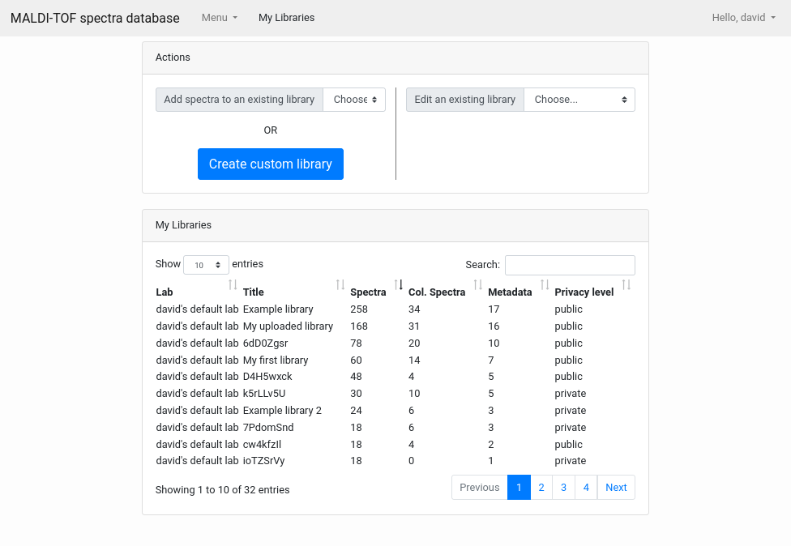

Creating a new library—privacy and quality ratings visible
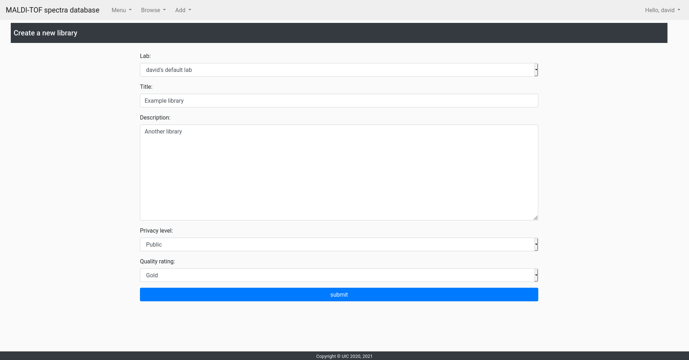


Library detail view with collapse option
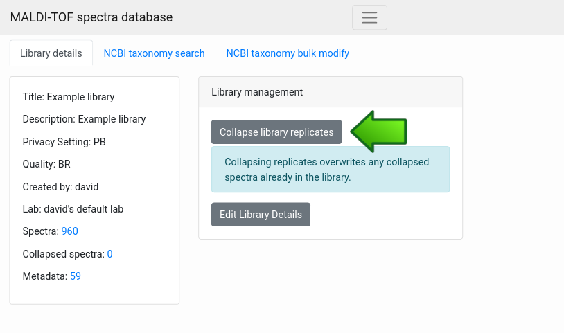


*Data Import*

The SQLite import pipeline handled real R01 data—13+ databases, thousands of spectra, with progress tracking.

SQLite import interface—single file or batch import from a known directory
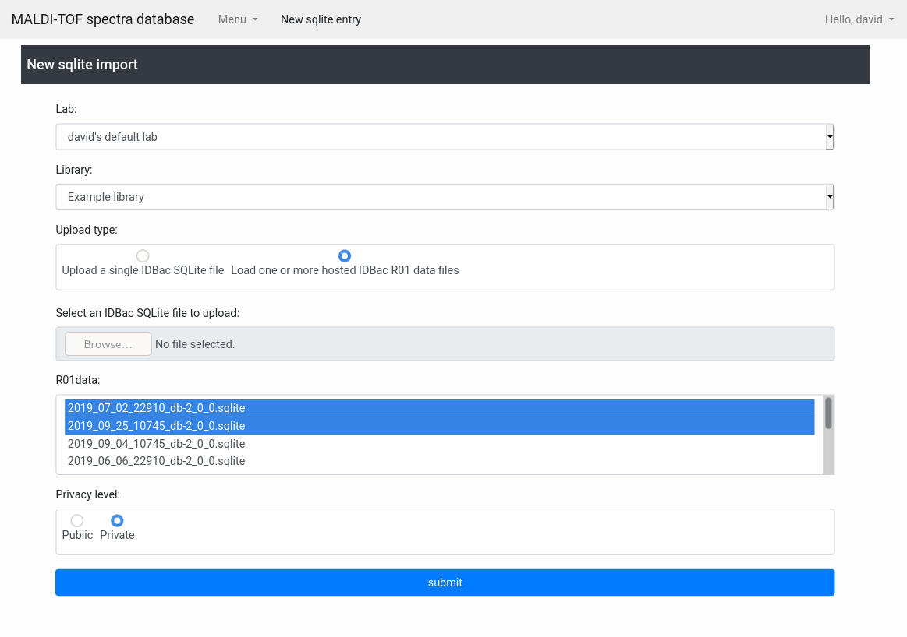


*File Upload*

Users could upload mzML/mzXML files with progress indicators and preprocessing options.

Initial upload view
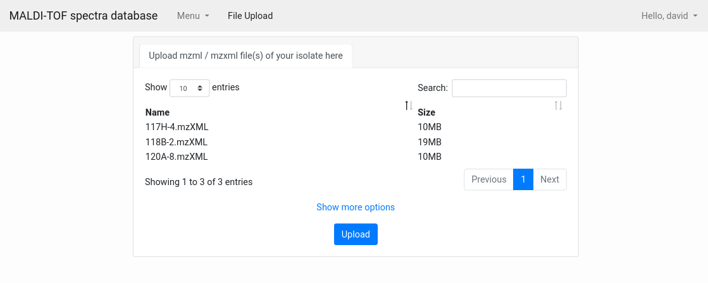

File selection pre-upload


Expanded options—library selection, preprocessing
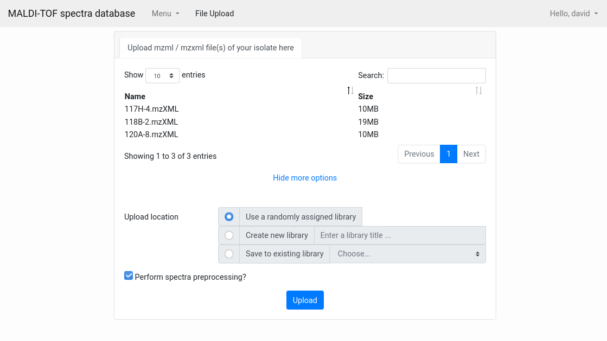

Upload queue with file listing
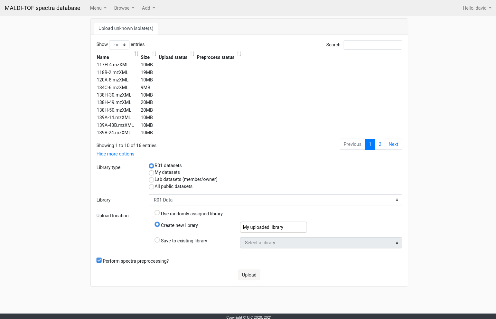


*Spectral Search*

The core scientific feature: upload an unknown spectrum and find matches in the database.

Search—start with file upload
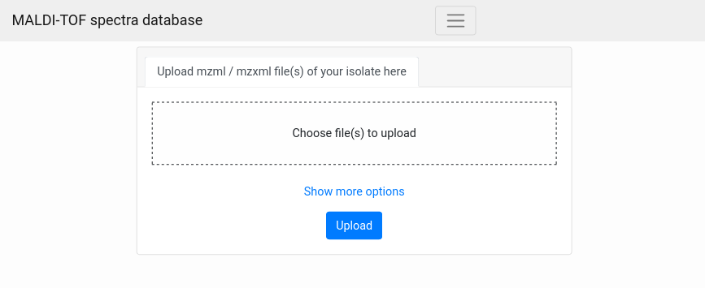

Expanded search options—library filters, preprocessing
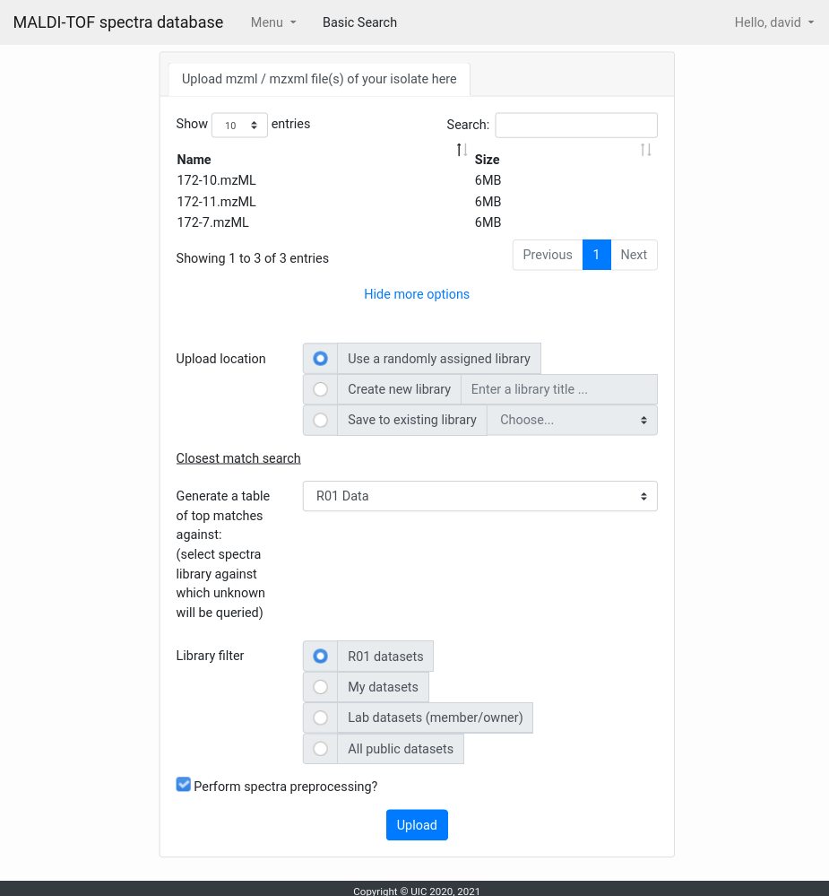

Search results with top scores per query
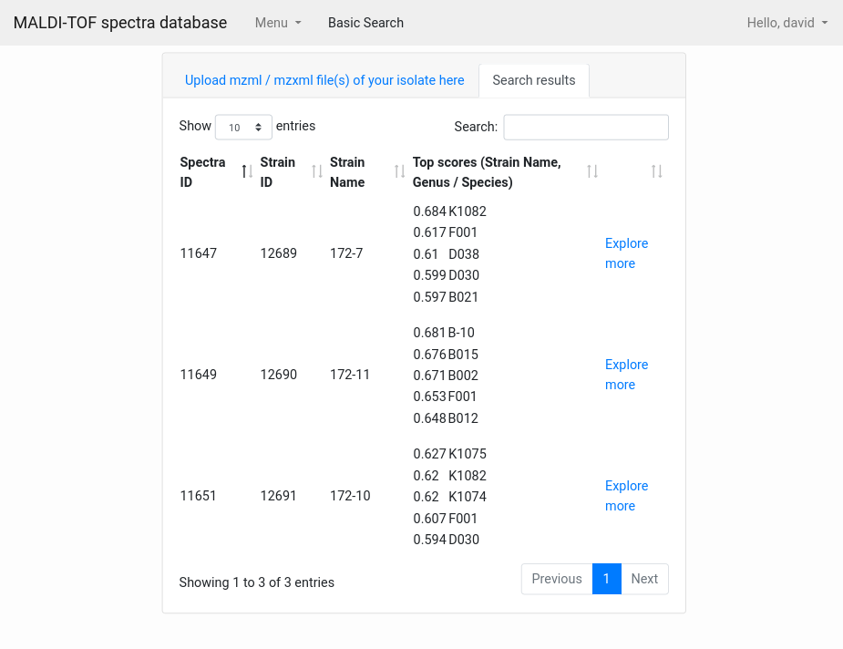

Detailed results with cosine similarity scores and circular dendrogram.
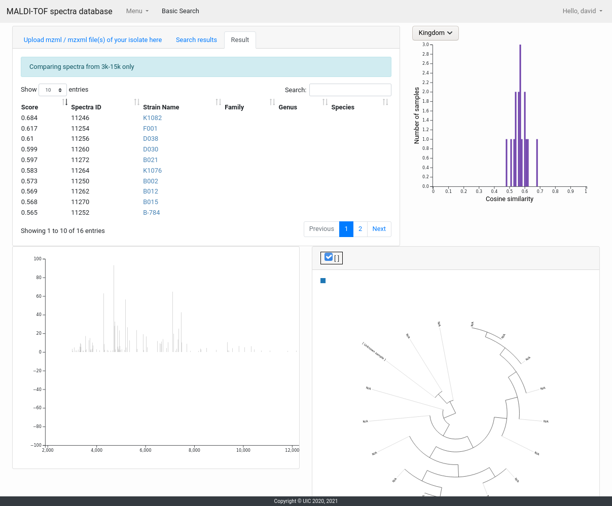


*NCBI Taxonomy Integration*

A late-stage feature: bulk lookup of NCBI taxonomy IDs to enrich metadata.

NCBI taxonomy search—find exact matches
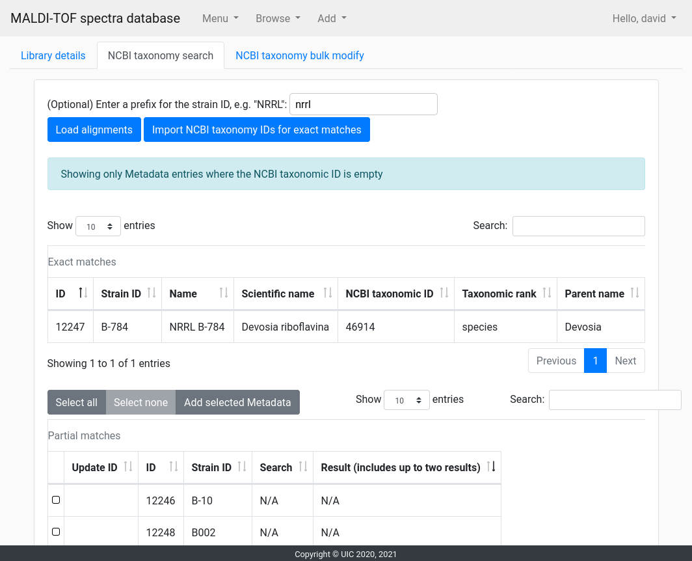

Results showing Devosia riboflavina match
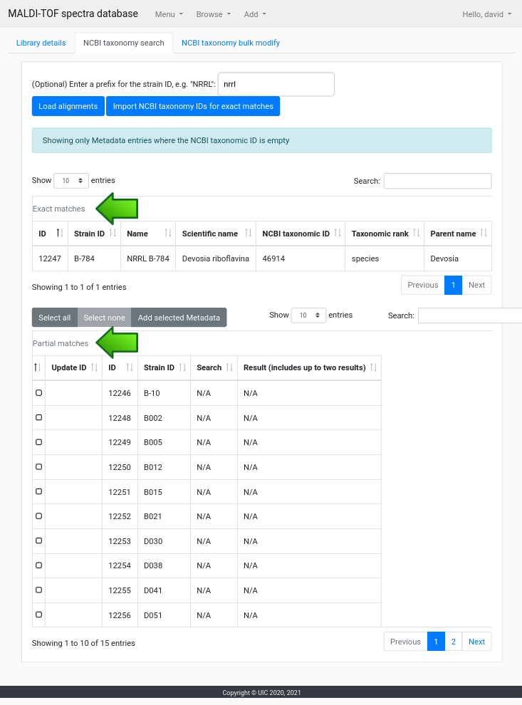

Bulk taxonomy import—paste strain IDs, genera, species
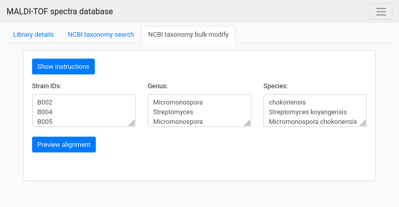

Bulk results—exact and partial matches
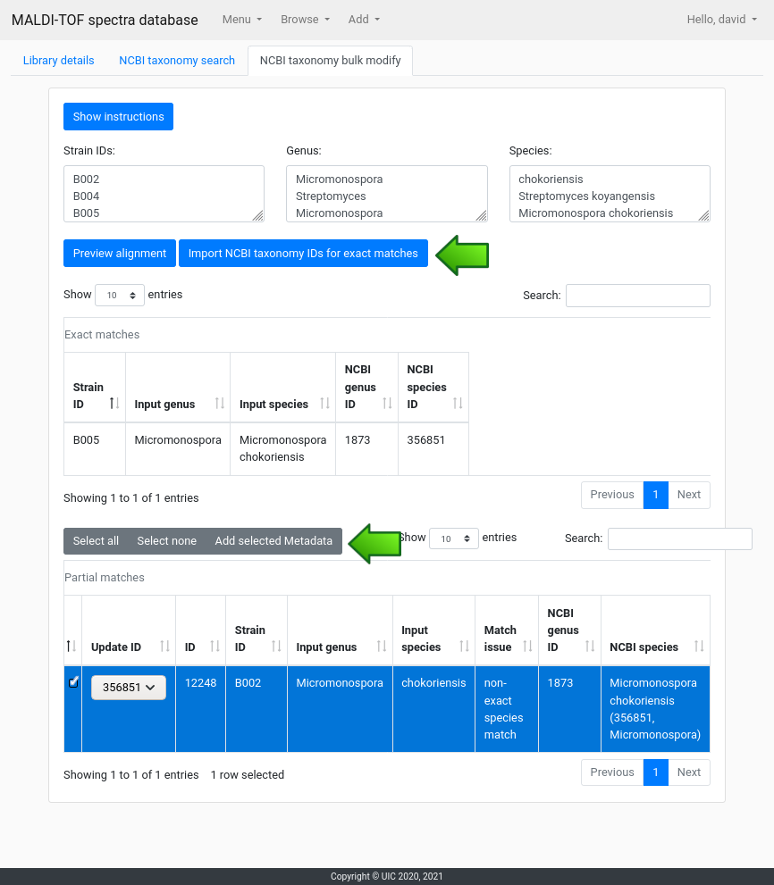


*What the Screenshots Show*

Taken together, these screenshots illustrate:

* The platform was real—not just diagrams, but working interfaces with real data.

* The workflows matched scientific needs—library management, batch imports, spectral search, taxonomy enrichment.

* The UI was usable—Bootstrap 4, progressive disclosure, clear navigation.

* The integration worked—R API calls, database queries, file processing all happened behind the scenes.

* It was incomplete—some UI elements are rough, workflows could be streamlined, features are half-implemented. That's the nature of a nine-month sprint at the end of a three-year project.


   
## Conclusion

Building MALDI-DB was a journey from concept to working platform over three years. We learned that scientific software requires deep domain knowledge, thoughtful data modeling, and robust infrastructure. The platform we built can serve as a foundation for community-driven bacterial identification, a resource that didn't exist before.

For researchers building similar platforms, I hope this technical overview helps you navigate the challenges of integrating web frameworks with scientific computing, handling complex data models, and building community features that scientists actually need.

The complete codebase is available at https://github.com/idbac/maldidb. We welcome contributions from the community.

---

This work was supported by NIH grant #R01GM125943. The platform was built in collaboration with domain scientists who developed the IDBac R analysis package. The views expressed are those of the author and not necessarily those of the National Institutes of Health.
